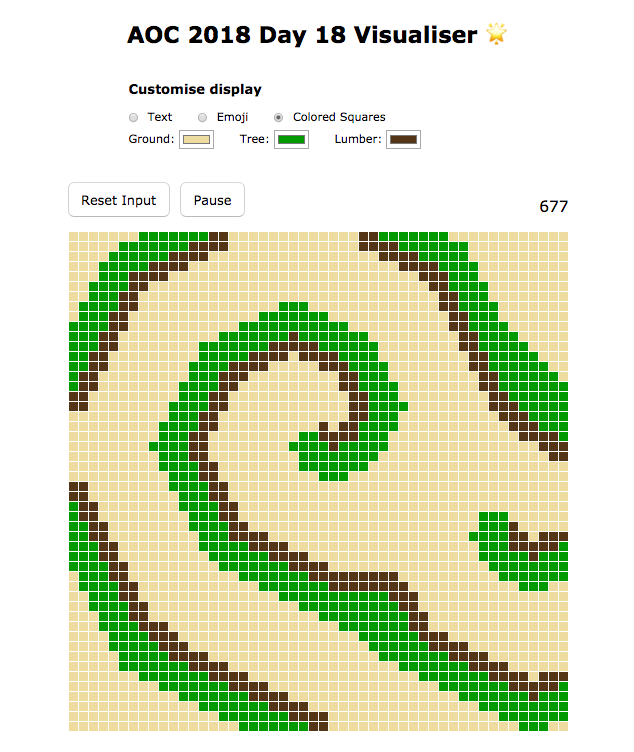

# AOC 2018 Day 18 Visualiser

Advent of Code 2018 - [Day 18](https://adventofcode.com/2018/day/18)

Deployed - [http://natalieytan.github.io/aoc2018-day18-visualiser](http://natalieytan.github.io/aoc2018-day18-visualiser)

## AoC Visualiser
This puzzle lends itself to visualization.
This app written in react lends itself to creating a customisable visualistion for any puzzle input.




## Summary of puzzle:
### Symbols
- . = ground
- | = trees
- \# = lumberyard

### Every Minute:
- An open acre will become filled with trees if three or more adjacent acres contained trees. Otherwise, nothing happens.
- An acre filled with trees will become a lumberyard if three or more adjacent acres were lumberyards. Otherwise, nothing happens.
- An acre containing a lumberyard will remain a lumberyard if it was adjacent to at least one other lumberyard and at least one acre containing trees. Otherwise, it becomes open.

### Sample Input
```
..##..#|#..#.#.||........|||...#..|....||......|..
##.#.#....##..###...##|#...|...||.#...#|.|.#...#|.
....##|....|#.........#|..|......#...##.#..|....##
###...||#|.......#|..#.#||...|....|......||..|..|.
......||.|.....#.#####.#.#.|...|##....#...#.......
#..|..#.|.......#......#.#|.........|##....##.||#.
|##..#|...|.#.....#..|.||#.|..##..#...||#.#.|.....
...|.#.|....||...#.||#|...|..#.#........|.|||....#
..|||#.|...#.##.||.......#.|.#.|..|#|..|.|##.#...#
|#...#.....#...#...#||..|.......|.|..|.##..#.#..#.
......||...#.#||...|.||.|#.|..##|.||....#..##.##..
#|........#|...|#.|.||#||...#..|#...#...##.|.|....
|#.||..##|#.|.|....#.#.......|.#.|.|.#.....#.|....
....###.|.#...|#.|##.||....|#.#....#...|...||.|..#
.....#..#|..|#.#..###..#.|#.....###.|......#|.#.|.
||.##....|....#..||#.#....|.##.|...#.|##..........
#|#.#..|..|#....#.#.|..||...|..........#|.........
.#|.##..|.|.|..#|...|..|..|.#....|#|.....#|.#...|.
|....|.|..#..#|..#.###.|||......|.###..|..........
#|#.#.......|...|||.||##.....##..||...|..##...##..
.|||...#.|....##....#..#..........|..#..........|.
.#....#...#..##....#.#......||...##....|...#..|.|.
|||....||#....|...|.....#.#..||.|.|..#..|...||....
###...|#|...|...||.##.#....|.....##....#|#.#|#||.#
..#.|....#|.|..#......#..|..|#|....#.......#.|#..|
.##..|#.|......|..#.##..#.#....|#.....#...|.....#.
.|.|.....|..|..|..........|....#..##..#|.##.|..||#
|..#.|.|..#......#||...||.#..#..|.......|.#.|.....
|....|.#..#||....|#.#|....#|..#|.#.|##.....|.||.#.
....|#.||.#..#....||||..|.|#.|#...|..|#.#.#|#..###
#....#.#..|..#|.|.|..||.#......|......|.|......#|#
|##|......||.#...#......#.|..||....|.#..........#.
##...|...#.....#...|.#..||...|.#|.##...|.#...#.|..
...|..||...#.#....#|.#...###......#|#.|.|.#|.....#
.#||...##....|...##.#|.#.#..#.........#..#....||#.
....#.....|..|.|..#|.......|.|..#....#|.#......#.#
........#.|....#..|..|..|...|.|#|.#.#......#|..||.
...#...#..#.||#|||...#.|........|#.#|........###.#
###..#.|..|...||..||......|##.||...#.|.|##.|.#|##|
|#||||#|..|..|..||.....#|.#....#..#......#...##.||
...#..|..###.#.|..|#.||..|.#.||....#|#|##...#..|.#
.##.#..|#|##.|...#..|.##..|.#||.#.|#..#....##.....
.#.#.|......|....#.....|||.||...#.#.||.|.||#|.#..|
.....#.#..|.|##.....|.|#|.##.#...|..#......##.|...
##.#.#.##|.#.||#..|.|.|.|.|#.##.|#.|...#......#||.
.....|..#......#.#..|##||||..|..#...#|#...|#...|##
....#..|..|.|...|.|...|#....#.#.|.#..||...|#.||...
...|..|||.#|.||.|#.##.|....#|.||.......#...#.|...#
....#.|.||||.....##........#.......#....|#|##....#
.#.|#||...|..|...|..|...##.#||...||......#.||##..#
```